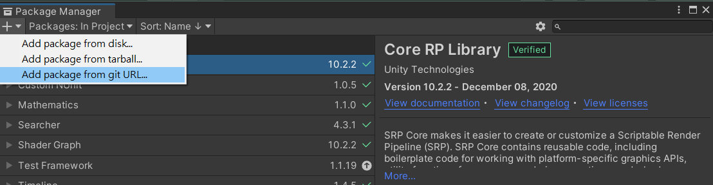
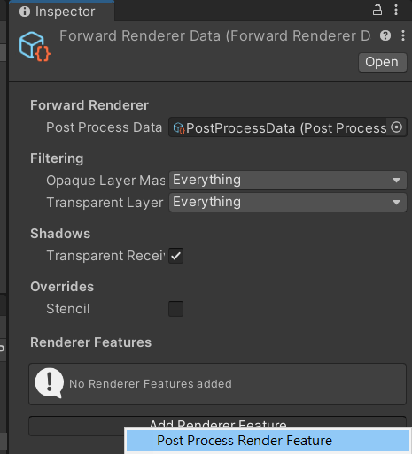
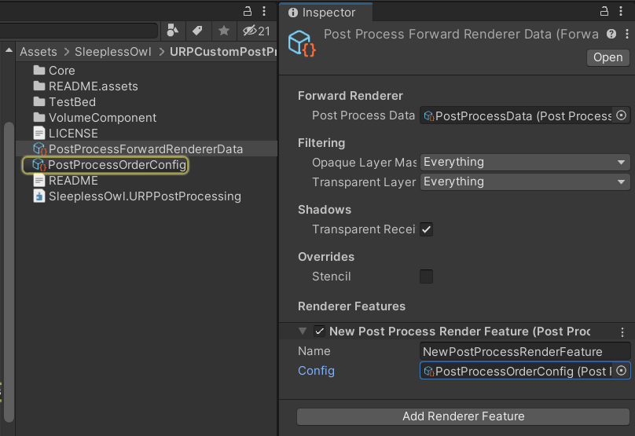
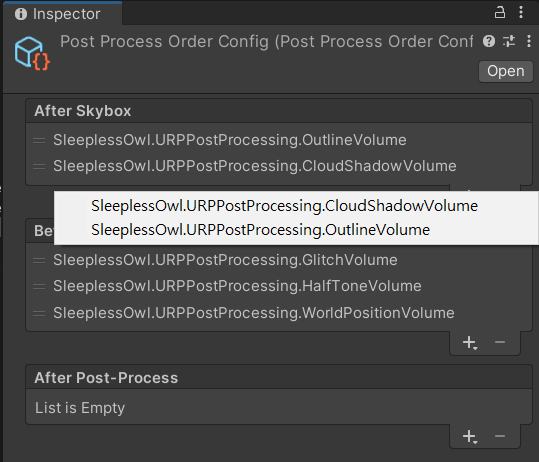



# Intro

一个 URP 自订义后处理框架，类似于HDRP扩展后处理的方式，另包含了一些自己的实作。

虽然URP目前可以每个后处理自己写一个RendererFeature，但当数量多时相当麻烦，所以参照HDRP的方式写了一个URP版本。

# Feature

* 可自己排序后处理执行顺序
* 支援新版Unity的`Volume System`

# Content

* Outline
* Glitch
* HalfTone
* WorldPosition (need enable DepthTexture in UniversalRenderPipelineAsset)
* CloudShadow (need enable DepthTexture in UniversalRenderPipelineAsset)


# How to use

## Instal



透过PackageManager点击Add package from git URL后贴上网址
https://github.com/SleeplessOwl0102/URP-Custom-Post-Processing.git

## Render Feature Setting

1. 选取专案中的ForwardRendererData，并加入PostProcessRenderFeature。



2. 拖入自己新增或Package内原始提供的PostProcessOrderConfig。

   

3. 新增并排序自己需要的后处理功能后，即可在场景中透过`Volume Component`使用。

   

## Custom Extend

新增一个Class并继承PostProcessVolumeComponent，并Override提供的Method即可，可参考 [HalfToneVolume.cs](VolumeComponent\HalfToneVolume.cs) 中的注解。

```c#
using System;
using UnityEngine;
using UnityEngine.Rendering;
namespace SleeplessOwl.URPPostProcessing
{
    [Serializable, VolumeComponentMenu("SleeplessOwl PostProcessing/HalfTone")]
    public sealed class HalfToneVolume : PostProcessVolumeComponent
    {
        public BoolParameter _visibleInSceneview = new BoolParameter(true);
        public FloatParameter _Density = new FloatParameter(0);
        public FloatParameter _Radius = new FloatParameter(0.3f);
        public FloatParameter _SmoothEdge = new FloatParameter(0.2f);
        public FloatParameter _HalfToneFactor = new FloatParameter(0.5f);
        public FloatParameter _SourceFactor = new FloatParameter(0.5f);
        public FloatParameter _Lightness = new FloatParameter(1);
        public ColorParameter _PointColor = new ColorParameter(new Color(0, 0, 0, 1));
        public ColorParameter _ColorFactor = new ColorParameter(new Color(1, 1, 1, 1));

        private Material material;

        //Define this Post-Processing will be executed in which timing in URP pipeline.
        public override InjectionPoint InjectionPoint => InjectionPoint.BeforePostProcess;

        //Default is true.
        public override bool visibleInSceneView => _visibleInSceneview.value;

        //If return false, will skip this Post-Processing.
        //You should ensure the default parameter value will return false in this method, let disable volume component work.
        public override bool IsActive() => _Density.value != 0;

        //Cache parameter ids to avoid do the same thing every update.
        static class IDs
        {
            internal readonly static int _Density = Shader.PropertyToID("_Density");
            internal readonly static int _Radius = Shader.PropertyToID("_Radius");
            internal readonly static int _SmoothEdge = Shader.PropertyToID("_SmoothEdge");
            internal readonly static int _HalfToneFactor = Shader.PropertyToID("_HalfToneFactor");
            internal readonly static int _SourceFactor = Shader.PropertyToID("_SourceFactor");
            internal readonly static int _Lightness = Shader.PropertyToID("_Lightness");
            internal readonly static int _Color01 = Shader.PropertyToID("_Color01");
            internal readonly static int _ColorFactor = Shader.PropertyToID("_ColorFactor");
        }

        //Create shader material.
        //You should put shader in the Resources folder, ensure it will be included in Asset Bundle, or add it use another way by yourself.
        public override void Initialize()
        {
            material = CoreUtils.CreateEngineMaterial("SleeplessOwl/Post-Processing/HalfTone");
        }

        public override void Render(CommandBuffer cb, Camera camera, RenderTargetIdentifier source, RenderTargetIdentifier destination)
        {
            //Update parameter
            material.SetFloat(IDs._Density, _Density.value);
            material.SetFloat(IDs._Radius, _Radius.value);
            material.SetFloat(IDs._SmoothEdge, _SmoothEdge.value);
            material.SetFloat(IDs._HalfToneFactor, _HalfToneFactor.value);
            material.SetFloat(IDs._SourceFactor, _SourceFactor.value);
            material.SetFloat(IDs._Lightness, _Lightness.value);
            material.SetColor(IDs._Color01, _PointColor.value);
            material.SetColor(IDs._ColorFactor, _ColorFactor.value);

            //Set RenderTexture for shader use.
            cb.SetPostProcessSourceTexture(source);

            //Set render target and draw.
            cb.DrawFullScreenTriangle(material, destination);
        }

        //Do something before Destroy(), if you need.
        protected override void CleanUp()
        {

        }
    }

}
```


# Reference

* https://github.com/keijiro/Kino

* https://github.com/Unity-Technologies/Graphics/tree/master/com.unity.testing.hdrp
